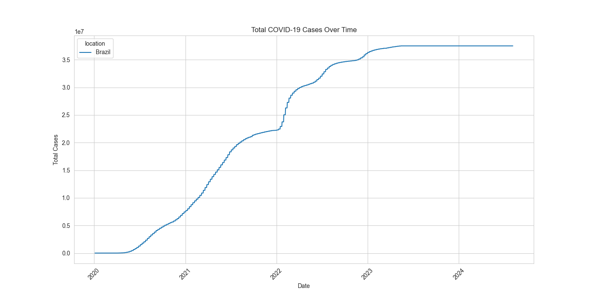
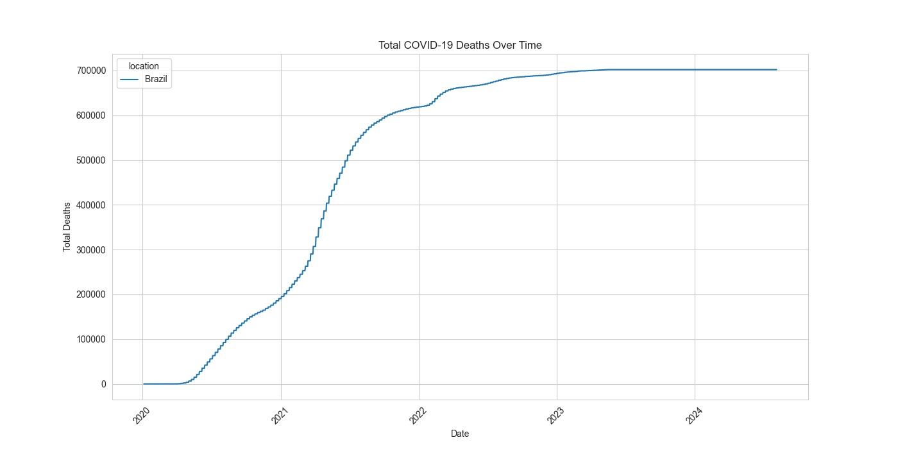

# 📊 COVID-19 Data Analysis

## 📈 Visualizations

### 1. Total Cases Over Time
  
*Trend of total cases across selected countries.*

### 2. Total Deaths Over Time
  
*Trend of total deaths across selected countries.*

---

## 🚀 How to Use This Project

### Requirements
- Python 3.8+
- Libraries: `pandas`, `matplotlib`, `seaborn`

### Run the Analysis
```bash
python covid.py
